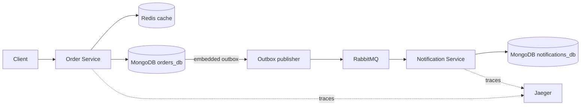

# Microservices Backend with Message Queue and Caching

A TypeScript npm-workspaces backend demonstrating service boundaries, MongoDB persistence, Redis caching, RabbitMQ messaging, JWT authentication, resilience, and OpenTelemetry.

## Current implementation status

The repository currently contains the shared contracts/platform foundation and MongoDB persistence infrastructure. HTTP service endpoints, Redis/RabbitMQ runtime wiring, full telemetry SDK initialization, load tests, and production Dockerfiles remain tracked in `todo.md`.

## Persistence architecture



Orders embed their items and pending outbox event, making order creation atomic without a transaction. Notification idempotency uses a transaction across `processed_events` and `notifications`; the unique `processed_events.eventId` index detects duplicates through E11000 rather than a pre-read. See [ADR 0003](docs/adr/0003-mongodb-document-model.md).

## Local MongoDB setup

Requirements: Node.js 24+, npm 11+, and Docker with Compose.

```sh
cp .env.example .env
docker compose up -d mongodb mongodb-init
```

The MongoDB service runs as a single-node replica set (`rs0`) because the notification persistence path uses a multi-document transaction. The application URI includes `directConnection=true` so host-side tools can connect even though the replica-set member uses its Compose hostname.

| Variable                        | Local default                                                     | Purpose                                |
| ------------------------------- | ----------------------------------------------------------------- | -------------------------------------- |
| `ORDER_MONGODB_URI`             | `mongodb://localhost:27017/?replicaSet=rs0&directConnection=true` | Order Service connection string        |
| `ORDER_MONGODB_DATABASE`        | `orders_db`                                                       | Order Service database                 |
| `NOTIFICATION_MONGODB_URI`      | `mongodb://localhost:27017/?replicaSet=rs0&directConnection=true` | Notification Service connection string |
| `NOTIFICATION_MONGODB_DATABASE` | `notifications_db`                                                | Notification Service database          |

Load the environment and apply the explicit collection validators and indexes:

```sh
set -a
. ./.env
set +a
npm run db:bootstrap
```

The bootstrap is idempotent and records checksums in each database's `_bootstrap_versions` collection. It creates `orders`, `processed_events`, and `notifications` explicitly; it does not depend on MongoDB's implicit collection creation.

Seed the deterministic order reserved for future cache benchmarks:

```sh
npm run db:seed
```

## Tests and quality checks

```sh
npm test
npm run test:coverage
npm run format:check
npm run lint
npm run typecheck
npm run build
```

Integration tests launch a real disposable single-node MongoDB replica set using `mongodb-memory-server`. The downloaded binary is cached under `.cache/mongodb-binaries` and is not committed.

The current repository has 63 passing tests. CI runs the formatting check, lint, type-check, build, and coverage-enabled full test suite on every push and pull request.

## Database tracing

The platform package exports a MongoDB OpenTelemetry instrumentation factory. Enhanced database reporting is disabled so spans retain operation/latency visibility without attaching document contents. It will be registered when the shared OpenTelemetry SDK initialization is implemented.
