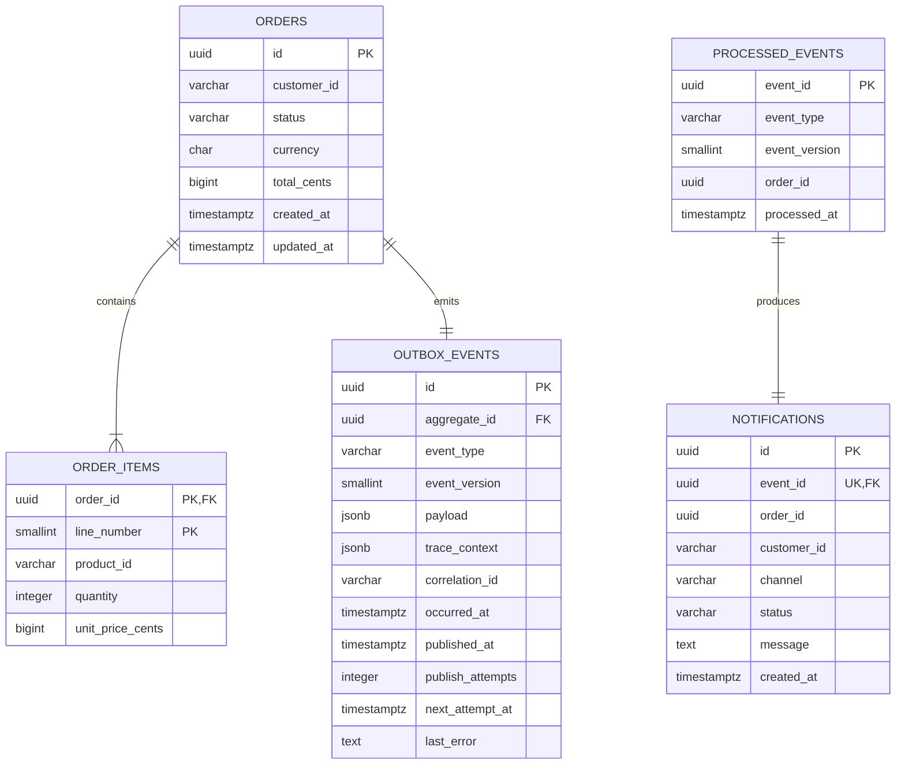

# ADR 0002: PostgreSQL Data Model and Transaction Boundaries

- Status: Proposed
- Date: 2026-09-11
- Decision required before migrations: Yes

## Context

The Order Service must persist orders and reliably publish `order.created`. The Notification Service must handle redeliveries idempotently and expose a protected read-only notification lookup. The model should make transaction boundaries and service ownership clear without adding unrelated product features.

## Proposed decisions

### Database ownership

Run one PostgreSQL container locally but create two logical databases with separate application credentials:

- `orders_db`, owned and accessed only by the Order Service.
- `notifications_db`, owned and accessed only by the Notification Service.

Services will not query each other's tables. The RabbitMQ event contains the immutable order snapshot needed by the Notification Service. This preserves service data ownership while keeping local orchestration lightweight.

### Identifiers, money, and timestamps

- Use application-generated UUIDs for orders, events, and notification records so IDs exist before persistence or publication.
- Store monetary values as integer minor units (`BIGINT`, such as cents), never floating point.
- Store currency as a three-letter uppercase code with a database check constraint.
- Store all timestamps as `TIMESTAMPTZ` in UTC.
- Store status values as text with explicit check constraints so status changes remain ordinary SQL migrations rather than PostgreSQL enum alterations.

### Order transaction and transactional outbox

Create the order, its line items, and its `order.created` outbox record in one PostgreSQL transaction. A separate publisher claims pending outbox rows, publishes persistent messages using RabbitMQ publisher confirms, and marks rows published only after broker confirmation.

This avoids the failure window where an order commits but its event is never published. RabbitMQ delivery remains at least once, so the Notification Service must still be idempotent.

### Notification transaction

On a valid event, the Notification Service opens one database transaction and:

1. Inserts the event ID into `processed_events`.
2. Inserts the simulated notification into `notifications`.
3. Commits both records, then acknowledges the RabbitMQ delivery.

The primary key on `processed_events.event_id` is the idempotency gate. A unique constraint on `notifications.event_id` provides defense in depth. If the event ID already exists, the consumer treats the delivery as a duplicate and acknowledges it without creating another notification.

Failed attempts do not create a processed record. Retry count and failure routing remain RabbitMQ concerns and are recorded in structured logs and message headers. Terminal DLQ messages remain inspectable through RabbitMQ; successful notifications remain queryable in PostgreSQL.

## Proposed entity relationships

The two sides of the diagram live in separate logical databases. No cross-database foreign keys exist; the `order_id` stored by the Notification Service is an event-derived reference, not a database foreign key.

## Proposed tables

### `orders_db.orders`

| Column        | Type           | Rules                                                |
| ------------- | -------------- | ---------------------------------------------------- |
| `id`          | `UUID`         | Primary key                                          |
| `customer_id` | `VARCHAR(128)` | Not null, non-empty                                  |
| `status`      | `VARCHAR(32)`  | Not null; one of `pending`, `confirmed`, `cancelled` |
| `currency`    | `CHAR(3)`      | Not null; uppercase ASCII letters                    |
| `total_cents` | `BIGINT`       | Not null, non-negative                               |
| `created_at`  | `TIMESTAMPTZ`  | Not null                                             |
| `updated_at`  | `TIMESTAMPTZ`  | Not null and not earlier than `created_at`           |

Indexes:

- Primary-key index on `id` for the fetch-order hot path.
- `(customer_id, created_at DESC)` for future customer-order lookup without changing the core model.
- `(status, created_at)` to support operational inspection of pending orders.

### `orders_db.order_items`

| Column             | Type           | Rules                                           |
| ------------------ | -------------- | ----------------------------------------------- |
| `order_id`         | `UUID`         | Foreign key to `orders(id)` with delete cascade |
| `line_number`      | `SMALLINT`     | Positive; composite primary key with `order_id` |
| `product_id`       | `VARCHAR(128)` | Not null, non-empty                             |
| `quantity`         | `INTEGER`      | Between 1 and 1,000                             |
| `unit_price_cents` | `BIGINT`       | Non-negative                                    |

The application calculates `total_cents`; the repository verifies the same invariant before insertion. An integration test will also compare the persisted line total with the order total.

### `orders_db.outbox_events`

| Column             | Type           | Rules                               |
| ------------------ | -------------- | ----------------------------------- |
| `id`               | `UUID`         | Primary key and public event ID     |
| `aggregate_id`     | `UUID`         | Foreign key to `orders(id)`         |
| `event_type`       | `VARCHAR(128)` | `order.created` initially           |
| `event_version`    | `SMALLINT`     | Positive; `1` initially             |
| `payload`          | `JSONB`        | Validated event payload             |
| `trace_context`    | `JSONB`        | W3C propagation fields              |
| `correlation_id`   | `VARCHAR(128)` | Not null                            |
| `occurred_at`      | `TIMESTAMPTZ`  | Event creation time                 |
| `published_at`     | `TIMESTAMPTZ`  | Null until broker confirmation      |
| `publish_attempts` | `INTEGER`      | Non-negative, default `0`           |
| `next_attempt_at`  | `TIMESTAMPTZ`  | Earliest publisher retry time       |
| `last_error`       | `TEXT`         | Nullable, sanitized failure summary |

Indexes:

- Partial publisher index on `(next_attempt_at, occurred_at)` where `published_at IS NULL`.
- `(aggregate_id, occurred_at)` for tracing an order's events.

The publisher will claim small batches with `FOR UPDATE SKIP LOCKED`, allowing safe future horizontal scaling without duplicate workers blocking one another. Published rows are retained for demonstration and troubleshooting; a retention policy can be added later.

### `notifications_db.processed_events`

| Column          | Type           | Rules                           |
| --------------- | -------------- | ------------------------------- |
| `event_id`      | `UUID`         | Primary key and idempotency key |
| `event_type`    | `VARCHAR(128)` | Not null                        |
| `event_version` | `SMALLINT`     | Positive                        |
| `order_id`      | `UUID`         | Event-derived order reference   |
| `processed_at`  | `TIMESTAMPTZ`  | Not null                        |

Indexes:

- `(order_id, processed_at DESC)` for order-based audit lookup.
- `(processed_at)` for retention and operational inspection.

### `notifications_db.notifications`

| Column        | Type           | Rules                                              |
| ------------- | -------------- | -------------------------------------------------- |
| `id`          | `UUID`         | Primary key                                        |
| `event_id`    | `UUID`         | Unique foreign key to `processed_events(event_id)` |
| `order_id`    | `UUID`         | Event-derived order reference                      |
| `customer_id` | `VARCHAR(128)` | Not null                                           |
| `channel`     | `VARCHAR(32)`  | `log` initially                                    |
| `status`      | `VARCHAR(32)`  | `sent` initially                                   |
| `message`     | `TEXT`         | Non-empty simulated notification                   |
| `created_at`  | `TIMESTAMPTZ`  | Not null                                           |

Indexes:

- `(order_id, created_at DESC)` for the protected notification lookup endpoint.
- `(customer_id, created_at DESC)` for audit/debugging.

## Migration ownership

Each service owns a numbered migration directory and migration history table in its database. The migration runner will:

- Acquire a PostgreSQL advisory lock so concurrent service replicas cannot migrate simultaneously.
- Apply pending SQL migrations in lexical order in individual transactions.
- Store filename and SHA-256 checksum for drift detection.
- Refuse to start if an already-applied migration's checksum changes.

## Consequences

- The transactional outbox adds a publisher worker and table but makes order-to-event consistency demonstrable and resilient.
- Separate databases prevent accidental cross-service joins and make event-carried data ownership explicit.
- Normalized line items make SQL constraints and repository behavior visible; Redis will cache the assembled order representation.
- Persisted mock notifications make idempotency observable through an API and integration tests.
- `BIGINT` values must be range-checked when converted to JavaScript numbers.

## Confirmation requested

Before migrations are written, confirm or revise these choices:

1. Separate `orders_db` and `notifications_db` databases in one local PostgreSQL container.
2. Transactional outbox instead of direct post-commit RabbitMQ publishing.
3. Normalized `order_items` rather than embedding items as `JSONB`.
4. Persisted `notifications` audit records rather than console-only simulation.
